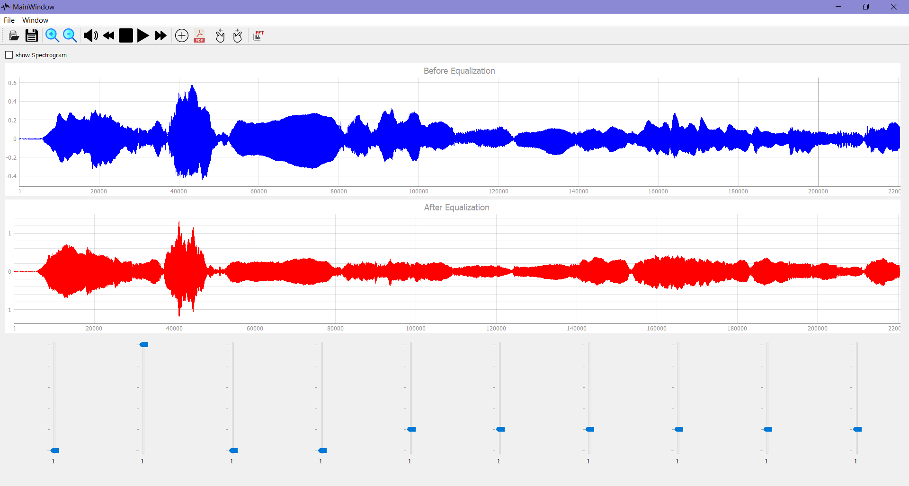
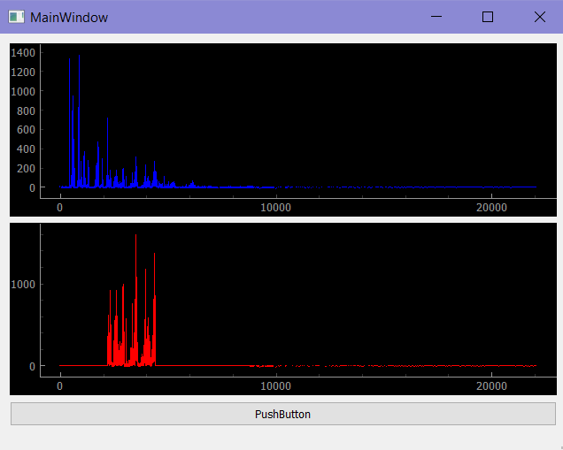
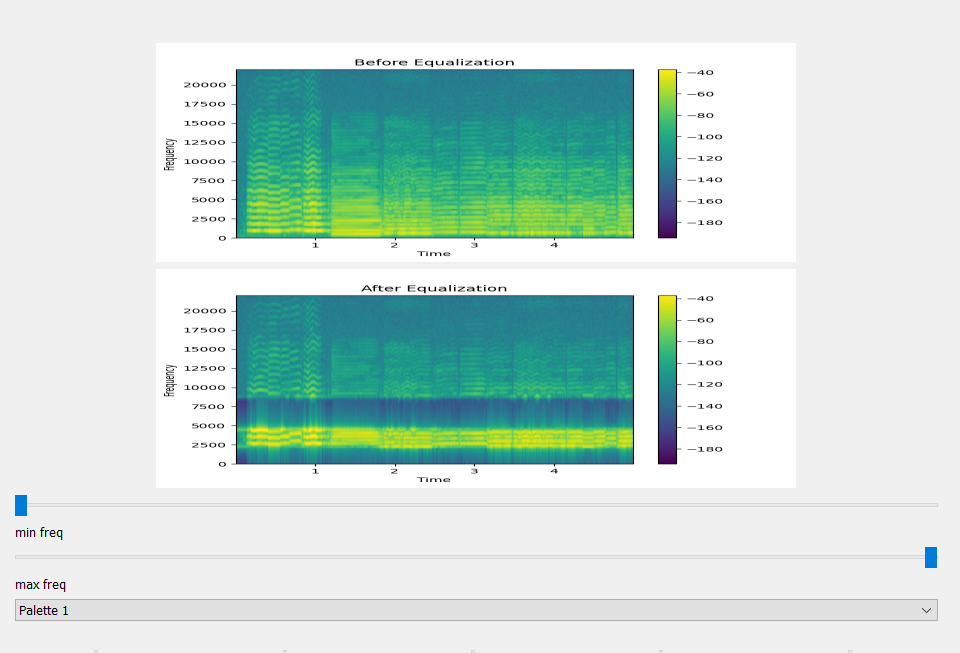

# Music Equalizer
A Music Equalizer Application that is used to:
* change certain frequencies of any .WAV signal/Sound 
* Show the FFT of the signal before and after equalization
* Show spectrogram of signal before and after
* Choose different color palets for spectrogram
* Play The signal before and after
* Scroll through the signal and zoom out and zoom in
* Save the new .WAV signal
# Running the app
In order to run the app run equalizer.py

# Images

